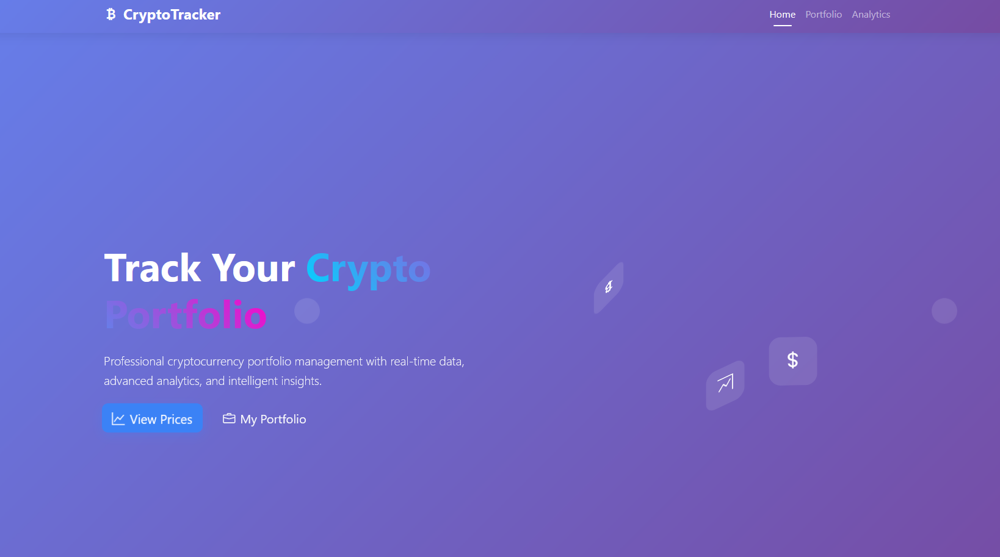
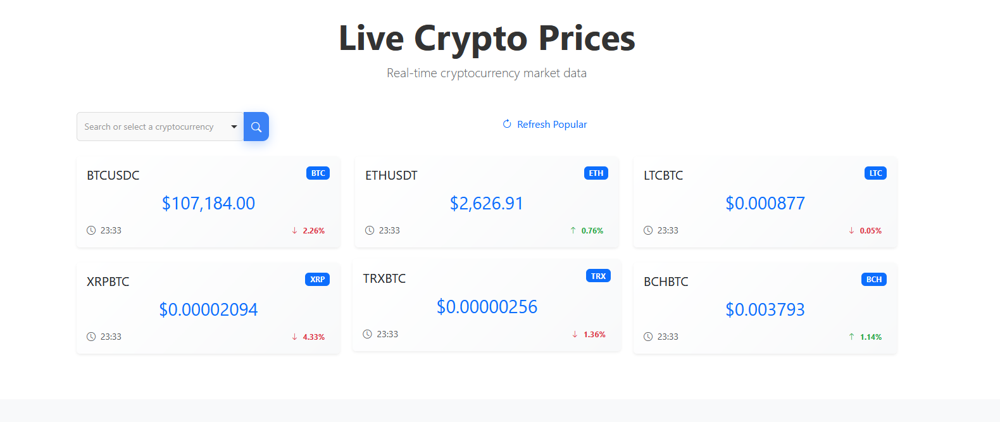
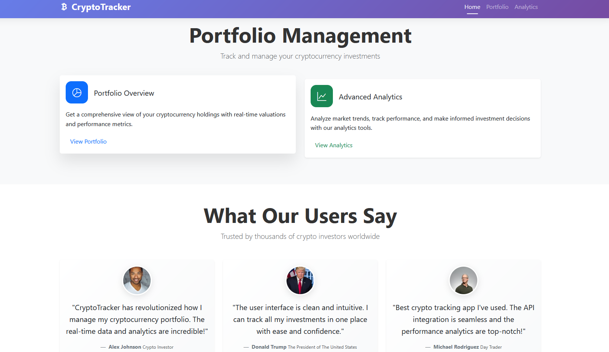
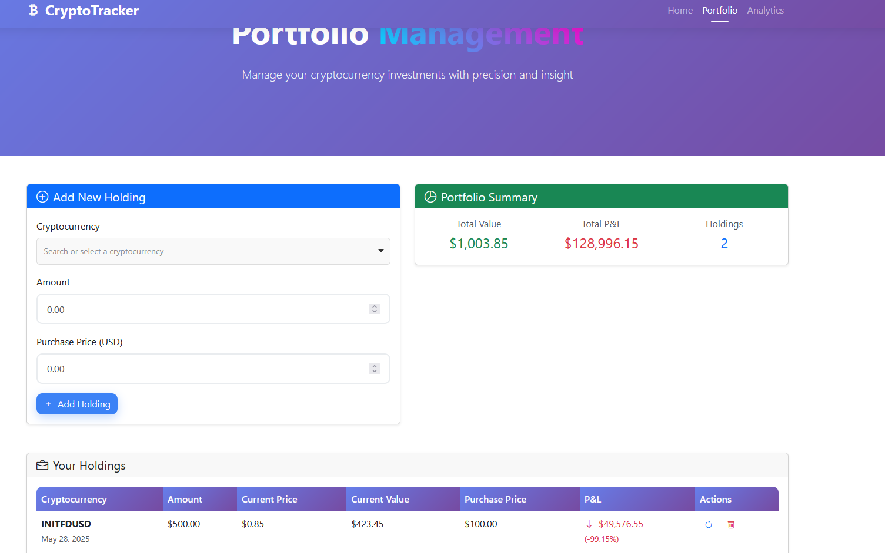
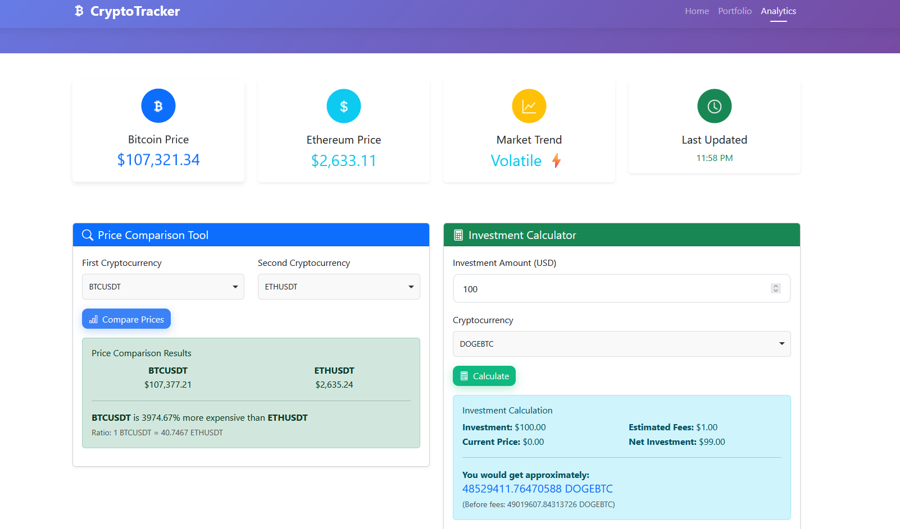

# 🚀 CryptoTracker

A modern, front-end **cryptocurrency dashboard** that lets you track live market prices, manage a personal portfolio, and explore basic analytics, all in one responsive website built with **HTML5**, **CSS3**, **Bootstrap 5**, and vanilla **ES6 JavaScript**.

---

## Author

**Abou Serhal Jamil Georges**

---

## Public APIs Used

| Purpose                          | API                       | Endpoint                                                   |
| -------------------------------- | ------------------------- | ---------------------------------------------------------- |
| Real-time coin prices            | Binance Public REST API   | `https://api.binance.com/api/v3/ticker/price`              |
| Symbol lookup (Binance listings) | Finnhub Crypto Symbol API | `https://finnhub.io/api/v1/crypto/symbol?exchange=BTCUSDT` |

> **Note :** Both APIs are free for basic requests. Finnhub requires an API key, which the app prompts for the first time you load the site.

---

## Project Overview

| Page                 | What it does                                                                                                                                                            |
| -------------------- | ----------------------------------------------------------------------------------------------------------------------------------------------------------------------- |
| **`index.html`**     | • Hero section with animated 3-D icons • Live-price dashboard (searchable with Choices.js) • Short feature blocks **& testimonials section** (custom requirement) |
| **`portfolio.html`** | Add trades, store them in **LocalStorage**, auto-update prices via `window.cryptoApp`, and display P&L, summary cards, and a responsive holdings table                  |
| **`analytics.html`** | Mini-tools for price comparison, investment calculator, and a playful market-insights demo                                                                              |

### Core JavaScript Classes

-   **`CryptoApp`** – fetches symbols & prices, renders price cards, and handles shared UI helpers.
-   **`PortfolioManager`** – CRUD for portfolio holdings and on-demand price refreshes.
-   **`AnalyticsManager`** – comparison & calculator utilities.

All pages share a global `window.cryptoApp` instance so they can reuse data without a heavyweight back-end.

---

## Custom Requirement – Testimonials Section

**Requirement :** “Include a testimonials section styled with Bootstrap cards.”

Implemented in **`index.html`** under the heading **“What Our Users Say.”**

-   Each testimonial is a Bootstrap 5 card (`.card.testimonial-card`) with a soft gradient background.
-   Avatars are circular with shadows and a gentle hover scale (`.testimonial-avatar`).
-   Quotes use semantic `<blockquote>`, and star ratings appear via **Bootstrap Icons** (`bi-star-fill`).
-   Cards sit inside a responsive `.row`, so they stack neatly on mobile.

---

## Getting Started

1. **Clone** the repository or download the ZIP.
2. **Serve** the files with any static server (e.g. VS Code Live Server, `python -m http.server`, or `npx serve`).
3. On first load you’ll be prompted for a **Finnhub API key** (free). Enter it, or choose **Demo Mode** for sample data.
4. Explore the **Portfolio** page, run comparisons in **Analytics**, and enjoy!

> ℹ️ Opening pages directly from the filesystem (`file://…`) may block API calls in some browsers so it's better to serve over `http://localhost`.

---

## Screenshots

---

## License

Released for educational purposes. Feel free to fork & enhance!  
© 2025 Abou Serhal Jamil Georges
